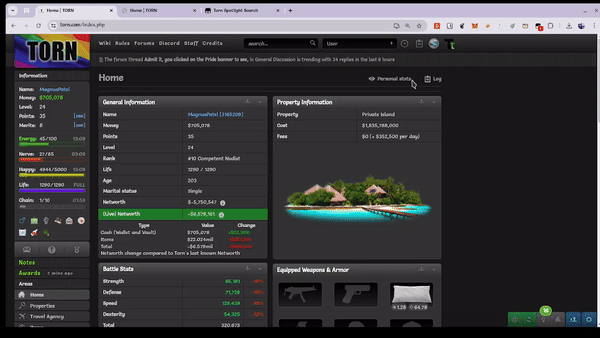

# Torn Spotlight Search

Navigate Torn with keyboard shortcuts via Spotlight Search.

## Configuration

1. Change `mainKey` to your preffered key.
2. Update `pressControlKey`, `pressShiftKey` and `pressAltKey` for key combinations you want to use.
3. Add / Remove / Update items in `urlDictionary` based on your needs.

## Updates yet to come

- [ ] Proper highlighting and styling of Spotlight Search.
- [ ] Easier way to customize and store key combinations.
